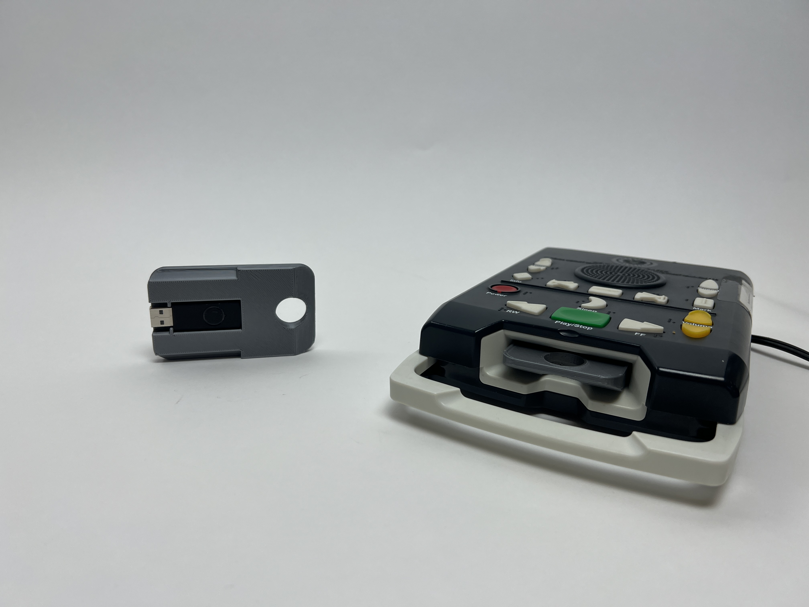

# Talking Book and Joy Player Cartridge

 Customizable model for usb swappable [talking book and joy player cartridges](https://www.aph.org/product/digital-talking-book-cartridge/)

## Features
- Works with [generic flashdrives](https://www.amazon.com/Kootion-Flash-Drive-Memory-Colors/dp/B016I79NPG/ref=sr_1_6?c=ts&keywords=USB+Flash+Drives&qid=1662518401&refinements=p_n_size_browse-bin%3A1259713011&rnid=1259751011&s=pc&sr=1-6&ts_id=3151491)
- Fully parametric and editable OpenSCAD script allows you to use any flash drive that will fit!
- Cost around $.50 to print and with cheap flash drives brings the total price to ~$1! 
- Print in any color
- Swappable storage and customizable

## Why?
While the Joy Player does have a usb port in the back, not every student is able to plug in flash drives correctly. The cartridge enables student's independnece but cost $14 and is not availble for purchase with quota funds. Our schools librarian was sick of spending $14 on each lost cartridge as students go through them and wanted a cost effective alternative. This model provides not only a cost effective solution but also an improvement on the original cartridge design. USB drives can be swapped for more or less storage, no need for a male to female usb cable to load cartridges, simply remove the usb drive and plug into the computer like any other flash storage. Also the OpenSCAD code is fully customizable and open source so one can add text, braille, or other tactile markers to the cartridge!

## Print Settings
.15 layer height, 15% infill, with supports and normal PLA settings provide great results takes ~2 hours to print and uses ~22g of filament (~$.60)

## To Do
- Longivity test with students
- Add tactile marker options 
- Add text or braille options (braille on sides of cartridge?)

